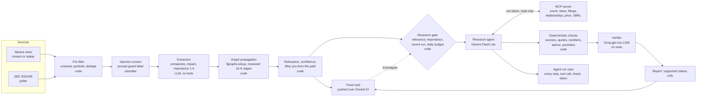

# Kesher AI

Kesher is personal market intelligence. It learns an investor's portfolio, watches market news and SEC filings, and explains exactly why an event matters to that investor. That includes events that reach a holding only through a supplier or a customer.

A TSMC earthquake headline shows how it works. It reaches an NVIDIA holder because NVIDIA's own 10-K names TSMC as its foundry. The card says so in one line built from that graph path, and it cites the filing quote. Research runs through read only tools, and a separate verifier checks every claim before the investor sees it.

It was built solo in two weeks as a bootcamp final project, on a MERN stack with AI agents and only free tiers.

Design: [docs/SPEC.md](docs/SPEC.md). Contracts: [docs/INTERFACES.md](docs/INTERFACES.md). Status: [docs/STATE.md](docs/STATE.md). Demo script: [docs/DEMO.md](docs/DEMO.md).

## Principles
- **The model understands, the code decides, the model explains.**
  - LLMs extract and explain.
  - Relevance, the research gate and every database write are deterministic code.
  - "Why you" lines are rendered from the graph path with templates, never written by a model.
- **No evidence, no edge.** Every relationship in the interest graph carries a source, a verbatim filing quote and a reviewed flag.
- **Identity from the session only.** No tool, route or function takes a user id a model could choose. MCP run tokens carry the user and the allowed tools.
- **External content is untrusted data.** News and filings are screened for injection. They reach models quoted as data, and agents that read them get read only tools.
- **Association, not causality.** A price move is shown next to its benchmarks (SMH, SPY), as timing only, unless a source states the cause.
- **Information, not advice.** A code check removes any claim with buy, sell or hold language.
- **Zero extra spend.** Every service runs on a free tier; a paid call is a bug.

## Architecture



- **Web:** React, TypeScript, Vite and Tailwind. There are three screens: the live feed with a persona switcher, the research report, and the agent run.
- **API:** Node, Express, Socket.IO, an MCP server on the official TypeScript SDK, and in process job queues.
- **Data:** MongoDB Atlas free tier, which holds the documents and provides `$graphLookup` over the interest graph, vector search on event and filing embeddings, and one text index for hybrid news search.
- **Models, all on free tiers through the Vercel AI SDK:**
  - Groq `openai/gpt-oss-120b` for extraction and the verifier;
  - Gemini `gemini-3.5-flash-lite` for the research agent;
  - Groq prompt guard for the injection screen;
  - local `Xenova/all-MiniLM-L6-v2` embeddings.
- **Market data:** Alpaca SIP bars and the market calendar. Price reactions are anchored to the regular session and always shown next to SMH and SPY, delayed 15 minutes.

## Demo personas
The feed switches between three seeded personas. Their password, `kesher-demo`, is public on purpose: the switcher is a demo control, not authentication.

| Persona | Holds | The TSMC headline |
|---|---|---|
| A, AI investor | NVDA, MSFT, AMZN | Medium 0.80, through "TSMC supplies NVIDIA" (NVIDIA 10-K) |
| B, semiconductor investor | AMD, AVGO, TSM, ASML | High 1.00, a direct holding |
| C, unrelated investor | KO, JNJ, XOM | None 0.00, never in the feed |

Bands are structural since T16: high only for a direct holding, medium for any other relevance above 0.

The demo replays one pinned, recorded Benzinga item (Alpaca news 38062166, 3 Apr 2024) through the same pipeline as live news.

## Run locally
Needs Node 22.12 or later (`.nvmrc` says 26) and a MongoDB Atlas free cluster. Copy `.env.example` to `.env` and fill it in.

```bash
npm install
```

```bash
npm run seed
```

```bash
npm run dev
```

The web runs on http://localhost:5173 and the api on 3001. **Replay demo event** in the top bar replays the pinned item, and **Investigate** on a card starts a research run. `npm run test` runs every test on an in memory mongod; no test calls a model provider.

## Deploy
The deployed instance is a Render free web service described by [render.yaml](render.yaml). It needs no card, and deploys are manual.
- It is **replay only** (`LIVE_INGEST=false`) with `DEMO_MODE=true`. The Replay control then resets and replays the pinned demo item for a signed in persona, and nothing else. Development routes are off in production.
- The api serves the web build on the same origin, with its routes under `/api`.
- The free instance has 512 MB, so `LOCAL_EMBEDDINGS=false` keeps the embedding model off. Research then runs without filing search, and the NVIDIA 10-K quote comes from the reviewed graph edge.
- Secrets are set in the Render dashboard.
- The public instance has its own free Atlas project and M0 cluster, seeded once with `npm run seed` and `npm run graph:apply`. It shares no data with development ([docs/DEMO.md](docs/DEMO.md), Public database).
- A free external cron pings `/health` every 10 minutes so the instance does not sleep.

After a deploy, run:

```bash
npm run smoke -- --url https://<service>.onrender.com
```

It checks health, the web shell, closed development routes, sign in and sockets for all three personas, the demo replay and its live pushes, the three relevance levels, the price reaction, and one Investigate with its run and report. `--no-investigate` leaves out the research run.

## Security
- **Secrets** live in `.env` locally, which git ignores, and in the host's environment variables when deployed; the host has no `.env` file. [.env.example](.env.example) lists every variable with no values. The code validates them at startup and names missing keys only, never values, and redacts the connection string and other secrets from agent run steps before they are stored.
- **Sessions** are an httpOnly cookie holding an HS256 JWT signed with `JWT_SECRET`. Every route and socket takes the user from that cookie only; none takes a user id as input.
- **Run tokens** scope each agent run. The api mints a JWT signed with `MCP_TOKEN_SECRET`, a separate secret, that carries the user, the agent and the tools it may call, and expires after 5 minutes. The MCP server refuses any tool the token does not list.
  - The research agent gets read only tools: `get_my_portfolio`, `get_event`, `search_news`, `search_filings`, `get_company_relationships`, `get_price_reaction` and `get_financial_facts`.
  - The verifier and the extraction model get no tools and no token.
  - Contract: [docs/INTERFACES.md](docs/INTERFACES.md), Run token.
- **Licensed data stays out of git.** Recordings keep a news item's headline and summary without the article body. Raw SIP bars stay in a gitignored local cache.
- **Reporting a problem:** please use GitHub's private vulnerability reporting (Security tab, "Report a vulnerability") rather than a public issue.

## Evaluation
`npm run eval` replays the eval set through the full pipeline on a local mongod, from recorded model answers, and writes [docs/EVALS.md](docs/EVALS.md) with every table and the tuning proposals. No provider is called, and CI runs the same replay. The numbers as of T16:

- **Relevance:** the code's band agrees with the user's label on 78 of 90 pairs (87%), 30 recorded news items × 3 personas: A 97%, B 63%, C 100%. Every disagreement sits on a graph path: 9 are a supply hop at 0.8, 3 are two hops.
- **Verification:** 17 of 17 planted errors caught, each by the check it was planted for, and no clean claim removed (the T14 fixture, one recorded verifier call of 2,377 tokens).
- **Injection:** on 5 synthetic poisoned items, the injected text changed the extraction in 2 of 5 without the screen and 1 of 5 with it. After the code defenses (the provider's tags as start nodes, an extraction with no tools), relevance moved in 1 of 5, where a suppression lowers persona A's card from high to medium and removes no card. The screen flagged 2 of 5 poisoned items and none of the 30 real ones.
- **Filing retrieval,** vector only on the free tier: precision at 3 is 70% and recall at 3 is 46% over 11 judged queries.
- **Passing mentions:** every company the provider tags starts the graph, and one the item only mentions reads medium (T27). On 4 market wraps this agrees on 9 of 12 pairs, against 3 of 12 under the earlier rule (only the tagged companies the extraction names) and 4 of 12 when every tagged company counts as named.
- **Graph review:** 22 of 28 relationships proposed from 10-K sentences were accepted.
- **Cost and latency per event:** a median extraction of 812 tokens (p95 915) in 687 ms (p95 2,242 ms), one injection screen call of 205 ms, and 3 ms of pipeline code. Every call is on a free tier, so $0.

## License
[MIT](LICENSE)
